<p align="center">
  
</p>

# Student Academic Performance Analysis: Statistical Drivers and Predictive Modelling

## Overview

This project investigates the key factors influencing student academic performance, using a dataset of 6,607 students containing demographic, behavioural, lifestyle, and environmental attributes. The analysis combines:

- **Non-parametric statistical tests**
- **Post-hoc comparisons**
- **Correlation analysis**
- **Predictive modelling (Random Forest Regression)**
- **Effect size estimation**
- **Visual exploration**

Through eight research questions, this project evaluates the relative contributions of study habits, motivation, resource availability, parental support, and socio-environmental variables to exam performance.

A machine learning model is then used to assess the predictive impact of these factors and identify their relative importance.

Clustering was explored but excluded after rigorous evaluation due to a lack of meaningful structure in the dataset.

---

# Dataset

The dataset contains the following key variables:

- **Behaviour:** Hours studied, attendance, tutoring sessions  
- **Lifestyle:** Sleep hours, physical activity, extracurricular activities  
- **Motivation and support:** Motivation level, parental involvement, teacher quality  
- **Environmental factors:** Access to resources, peer influence  
- **Socio-demographics:** Gender, school type, family income, parental education  
- **Outcome:** Exam score (continuous) + categorised exam score level

All analysis uses the **processed_df.csv** file generated during ETL.

---

# ETL Summary

The ETL workflow includes:

- Importing the raw dataset  
- Handling missing values  
- Encoding binary, ordinal, and nominal features  
- Creating a derived variable (**Exam_Score_Level**)  
- Exporting standardized and cleaned data to `processed_df.csv`

Key steps:

- Ordinal variables encoded with defined category order  
- Binary variables mapped to 0/1  
- Missing values (<1.5%) imputed using the mode  
- Exam scores binned into Low / Medium / High categories  
- All columns inspected for datatype consistency  

---

## 1. Parental Education Level vs Exam Performance  
**Question:** Does exam performance differ by students' parental education level?

```python
h_stat, p_val = stats.kruskal(*groups)

posthoc = sp.posthoc_dunn(
    df,
    val_col='Exam_Score',
    group_col='Parental_Education_Level',
    p_adjust='holm'
)
```

**Test:** Kruskal–Wallis H-test  
**Results:** H = 93.241, p < 0.001  
**Interpretation:**  
Students with higher parental education levels scored better on exams.  
Post-hoc Dunn tests (Holm-corrected) showed moderate differences between all three groups.

<p align="center">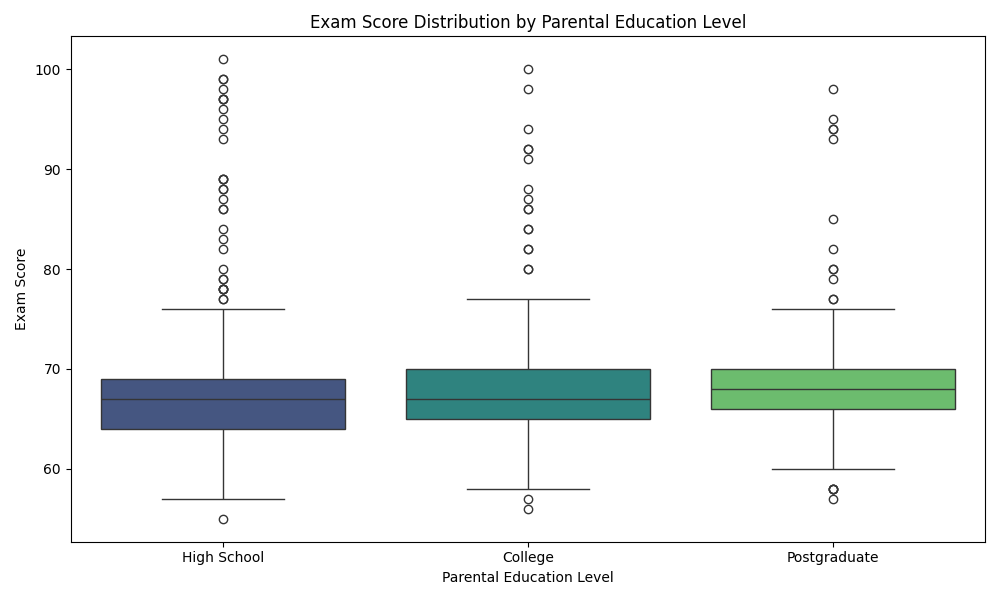</p>

<p align="center">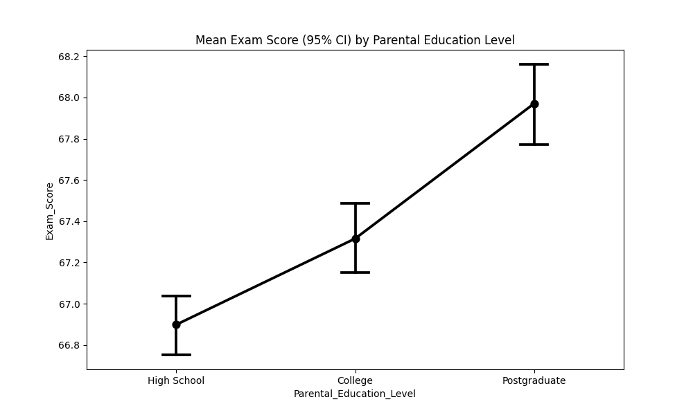</p>

---

## 2. Hours Studied vs Exam Scores  
**Question:** Is there a relationship between hours studied and exam scores?

```python
hours = df['Hours_Studied']
scores = df['Exam_Score']

spearman_rho, spearman_p = spearmanr(hours, scores)
```

**Test:** Spearman correlation  
**Results:** rho = 0.481, p < 0.001  
**Interpretation:**  
There is a moderate-to-strong positive correlation: students who study more tend to achieve higher exam scores.

<p align="center">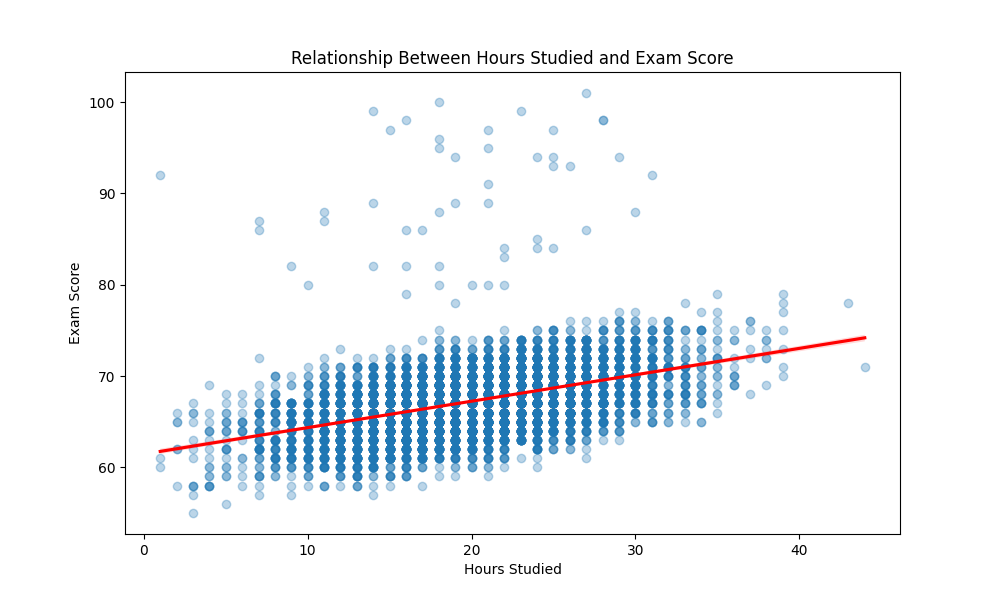</p>

---

## 3. Access to Resources vs Exam Scores  
**Question:** Does level of access to resources relate to exam performance?

```python
col = 'Access_to_Resources'
groups = [df[df[col] == level]['Exam_Score'] for level in df[col].cat.categories]

H, p = stats.kruskal(*groups)
```

**Test:** Kruskal–Wallis H-test  
**Results:** H = 231.678, p < 0.001  
**Interpretation:**  
Students with higher access to learning resources performed moderately better than those with limited access.

<p align="center">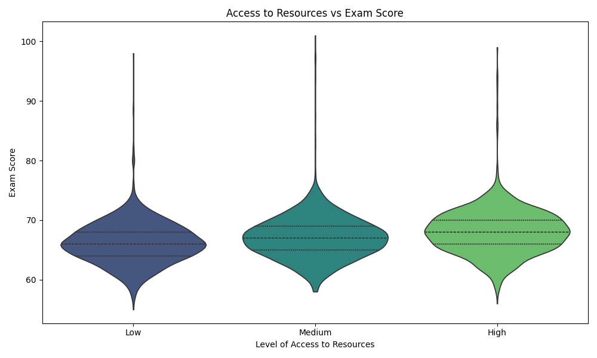</p>

<p align="center"></p>

---

## 4. Attendance vs Exam Scores  
**Question:** Is there a relationship between attendance and exam performance?

```python
attendance = df['Attendance']
scores = df['Exam_Score']

rho, p = spearmanr(attendance, scores)
```

**Test:** Spearman correlation  
**Results:** ρ = 0.672, p < 0.001  
**Interpretation:**  
Attendance is one of the strongest behavioural predictors of exam success. Students with higher attendance consistently achieved better scores.

<p align="center">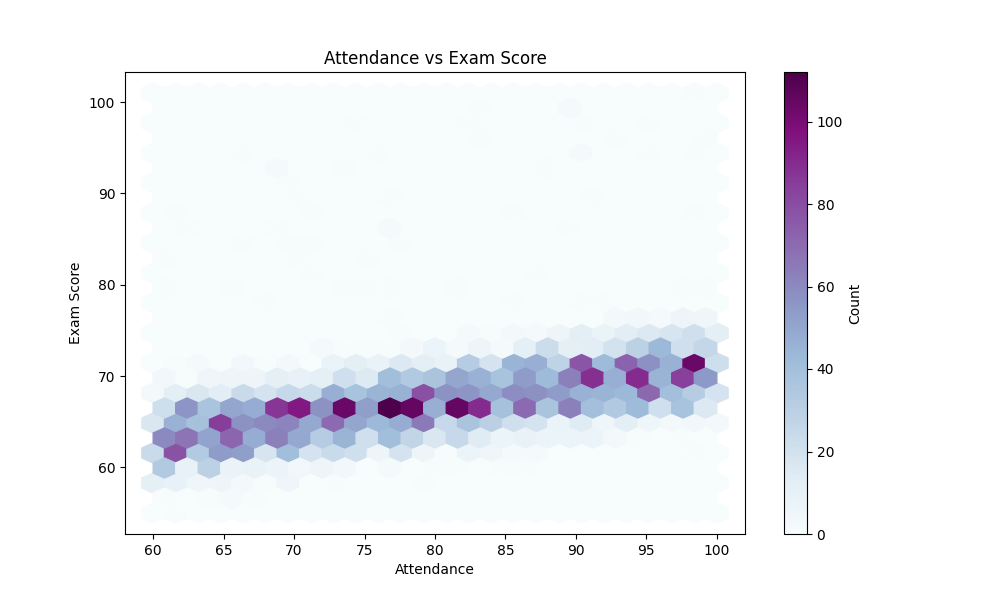</p>

---

## 5. Parental Involvement vs Exam Score Levels  
**Question:** Are exam performance levels independent of parental involvement?

```python
df['Exam_Score_Level_Chi2'] = pd.qcut(
    df['Exam_Score'],
    q=3,
    labels=['Low', 'Medium', 'High']
)

contingency_table = pd.crosstab(
    df['Exam_Score_Level_Chi2'],
    df['Parental_Involvement']
)

row_pct = contingency_table.div(contingency_table.sum(axis=1), axis=0)

chi2, p, dof, expected = chi2_contingency(contingency_table)
```

**Test:** Chi-Square Test of Independence  
**Results:** χ² = 154.149, p < 0.001  
**Interpretation:**  
Exam performance levels do depend on parental involvement, although the relationship is non-linear.

<p align="center">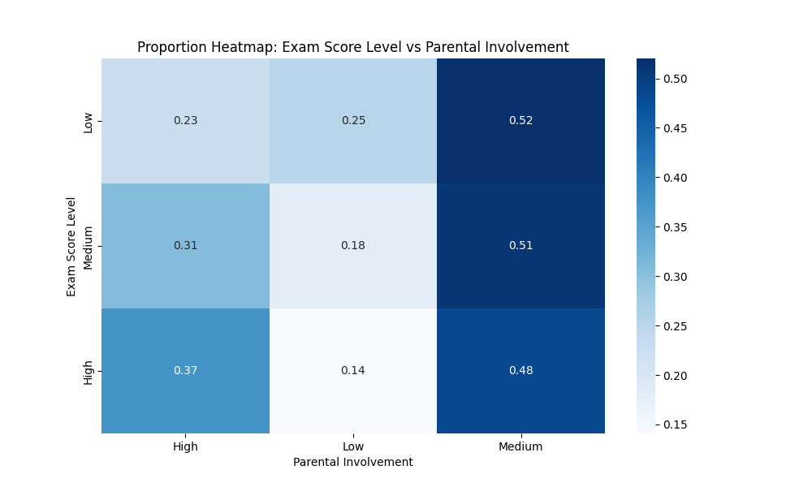</p>

---

## 6. Peer Influence vs Exam Scores  
**Question:** Is there a monotonic relationship between peer influence and exam performance?

```python
def jonckheere_terpstra_test(groups):
    '''
    Jonckheere–Terpstra test for ordered alternatives.
    groups: list of arrays, ordered from lowest to highest category.
    '''

    groups = [np.array(g) for g in groups]

    JT = 0
    for i in range(len(groups)):
        for j in range(i+1, len(groups)):
            g_i = groups[i]
            g_j = groups[j]

            for x in g_i:
                JT += np.sum(g_j > x) + 0.5 * np.sum(g_j == x)
    
    n = np.array([len(g) for g in groups])
    N = np.sum(n)

    mean_JT = (N**2 - sum(n**2)) / 4

    var_JT = (
        (N*(N-1)*(2*N+5) - np.sum(n*(n-1)*(2*n+5))) / 72
    )

    z = (JT - mean_JT) / np.sqrt(var_JT)
    p_value = 2 * (1 - norm.cdf(abs(z)))

    return JT, z, p_value
```

**Test:** Jonckheere–Terpstra Trend Test  
**Results:** JT = 7,770,018.5, z = 9.003, p < 0.001  
**Interpretation:**  
There is a moderate increasing trend: more positive peer influence aligns with higher exam scores.

<p align="center">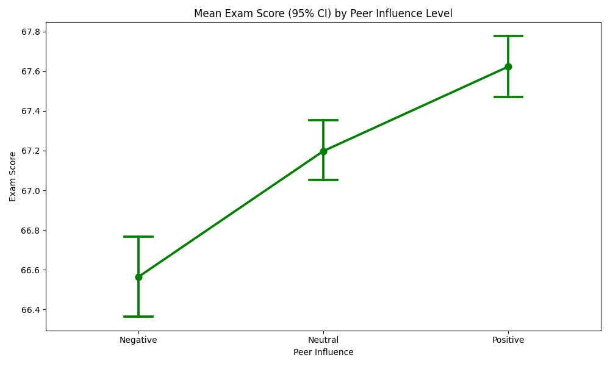</p>

<p align="center">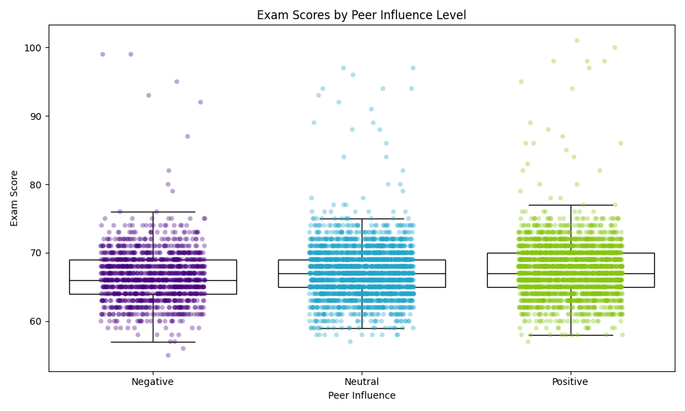</p>

---

## 7. Physical Activity & Sleep vs Exam Performance  
**Question:** Do physical activity and sleep influence academic performance?

```python
rho_pa, p_pa = spearmanr(df['Physical_Activity'], df['Exam_Score'])

rho_sl, p_sl = spearmanr(df['Sleep_Hours'], df['Exam_Score'])

X = df[['Physical_Activity', 'Sleep_Hours']]
y = df['Exam_Score']

X = sm.add_constant(X)
model = sm.OLS(y, X).fit()
```

**Test:** Spearman correlation + multiple linear regression 

**Results:**  
Spearman correlation

Physical Activity: rho = 0.029 (very weak), p = 0.018  
Sleep Hours: rho = –0.008 (none), p = 0.535 

Multiple linear regression

R² = 0.001

Physical Activity: coef = 0.105, p = 0.024

Sleep Hours: coef = −0.045, p = 0.167

**Interpretation:**  
Neither sleep nor physical activity shows a meaningful effect on exam performance.

<p align="center">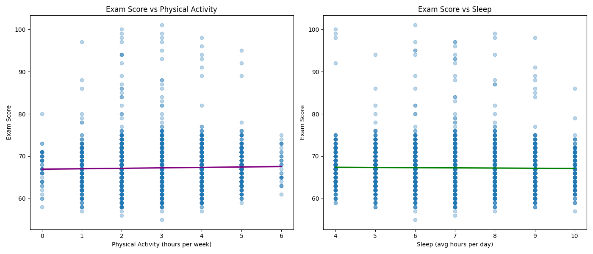</p>

---

## 8. Family Income vs Exam Scores  
**Question:** Is there a relationship between family income and exam performance? Are there more (perceived) high-quality teachers in private schools or public schools?

```python
col = 'Family_Income'
groups = [df[df[col] == level]['Exam_Score'] for level in df[col].cat.categories]

H, p = stats.kruskal(*groups)

contingency = pd.crosstab(df['School_Type'], df['Teacher_Quality'])
print(contingency)

chi2, chi_p, dof, expected = chi2_contingency(contingency)
```

**Test:** Kruskal–Wallis H-test + chi-squared test
**Results:** H = 63.800, p < 0.001  
**Interpretation:**  
Higher family income correlates with higher exam performance, though effect sizes remain smaller than behavioural predictors such as attendance and study time. 

The chi-square test findings indicate that teacher quality does not differ meaningfully between school types in this dataset

<p align="center">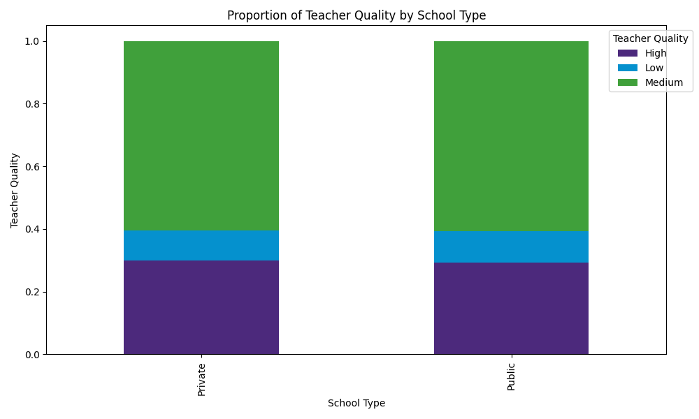</p>

---

# Predictive Modelling

A **Random Forest Regression model** was trained to quantify feature importance and predict exam scores.

### Model Performance
- **R²:** 0.672  
- **MAE:** 1.07  
- **RMSE:** 2.15  

### Feature Importance (Top Predictors)

1. **Attendance**  
2. **Hours Studied**  
3. **Previous Scores**  
4. **Parental Involvement**  
5. **Tutoring Sessions**  

<p align="center">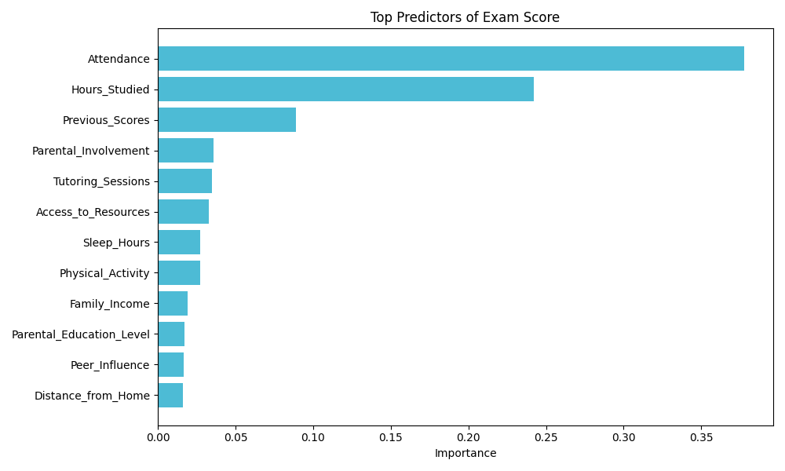</p>

---

# Clustering Analysis (Not Retained)

K-means clustering was explored to identify behavioural personas.  
Evaluation showed:

- Silhouette scores extremely low (max ≈ 0.09)  
- PCA projection indicated heavy cluster overlap  
- Cluster means differed negligibly  
- Exam score distributions were almost identical  

**Conclusion:**  
The dataset does **not** contain meaningful discrete behavioural groups.  

<p align="center">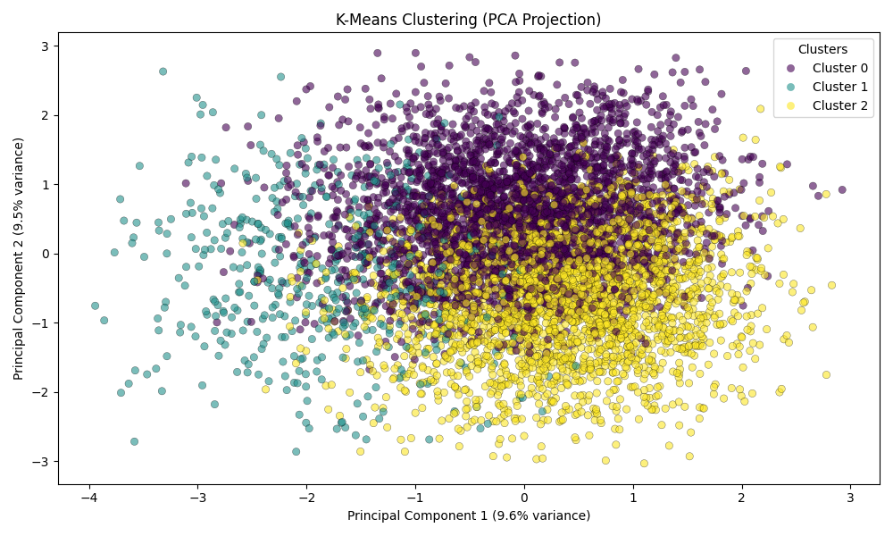</p>

---

# Tools & Libraries

- Python  
- pandas, numpy  
- scipy  
- scikit-learn  
- scikit-posthocs  
- matplotlib, seaborn  

---

# License

MIT License

<p align="center"><sub>Authored by <b>Sevban Ekşi (st3kin)</b> 2025</sub></p>